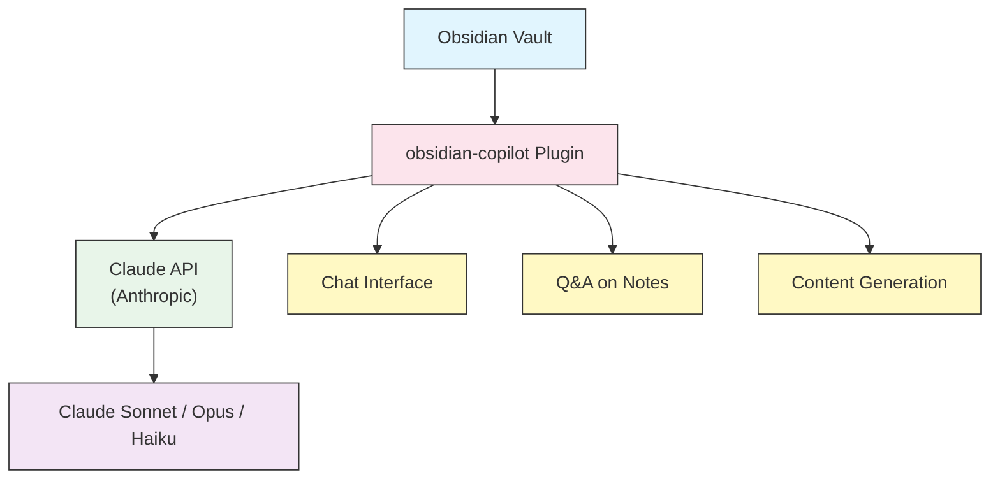
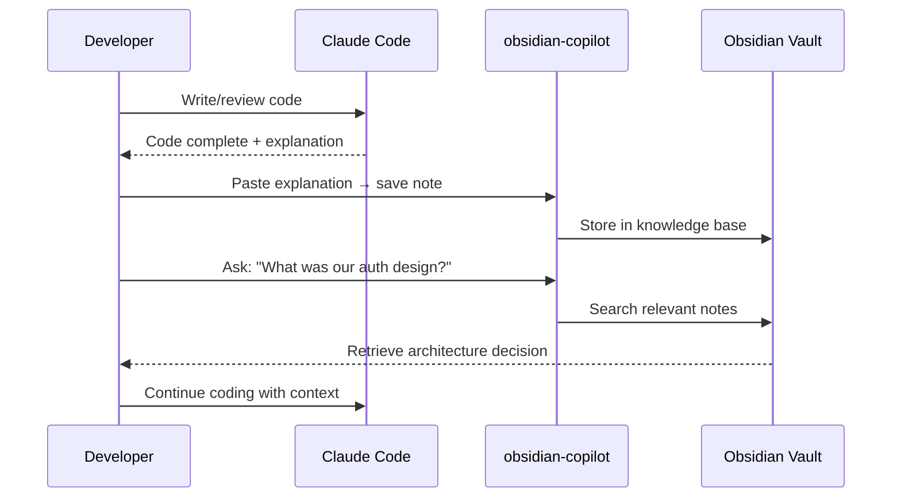

# Obsidian Copilot Integration

Bring Claude AI into your Obsidian vault with [obsidian-copilot](https://github.com/logancyang/obsidian-copilot) — a community plugin that adds AI chat, note Q&A, and content generation directly inside Obsidian.

---

## Table of Contents

- [Overview](#overview)
- [Prerequisites](#prerequisites)
- [Installation](#installation)
- [Configuration](#configuration)
- [Core Features](#core-features)
- [Workflow Integration with Claude Code](#workflow-integration-with-claude-code)
- [Best Practices](#best-practices)
- [Troubleshooting](#troubleshooting)
- [Related Guides](#related-guides)

---

## Overview

| Aspect | Details |
|--------|---------|
| **Plugin** | obsidian-copilot by Logan Yang |
| **Repository** | https://github.com/logancyang/obsidian-copilot |
| **Supported Models** | Claude (Anthropic), GPT-4, Gemini, local LLMs |
| **Obsidian Version** | 1.0+ |
| **Node.js** | 18+ (for building from source) |

### Architecture



---

## Prerequisites

| Requirement | Version | Install |
|-------------|---------|---------|
| Obsidian | 1.0+ | https://obsidian.md |
| Node.js | 18+ | https://nodejs.org |
| Anthropic API Key | — | https://console.anthropic.com |
| Git | any | https://git-scm.com |

---

## Installation

### Option A: Community Plugin Store (Recommended)

1. Open Obsidian → **Settings** → **Community plugins**
2. Turn off **Safe mode**
3. Click **Browse** → search `Copilot`
4. Click **Install** → **Enable**

### Option B: Build from Source (Fork)

```bash
# Step 1: Fork on GitHub, then clone your fork
git clone https://github.com/<your-username>/obsidian-copilot.git
cd obsidian-copilot

# Step 2: Install dependencies
npm install

# Step 3: Build the plugin
npm run build
```

```bash
# Step 4: Link to your vault (replace the path)
VAULT=~/path/to/your/vault

# macOS / Linux
mkdir -p "$VAULT/.obsidian/plugins/obsidian-copilot"
cp main.js manifest.json styles.css "$VAULT/.obsidian/plugins/obsidian-copilot/"

# Windows (PowerShell — run as Administrator)
# New-Item -ItemType SymbolicLink `
#   -Path "$env:USERPROFILE\Documents\MyVault\.obsidian\plugins\obsidian-copilot" `
#   -Target (Get-Location)
```

```bash
# Step 5: Watch for changes (development)
npm run dev
```

---

## Configuration

### Set the API Key

1. Obsidian → **Settings** → **Copilot** → **Basic Settings**
2. Paste your Anthropic API key in **Anthropic API Key**
3. Select your default model

### Model Selection

| Model | Speed | Context | Best For |
|-------|-------|---------|----------|
| `claude-haiku-4-5` | ⚡ Fast | 200K | Quick Q&A, summaries |
| `claude-sonnet-4-5` | ⚖️ Balanced | 200K | General use (recommended) |
| `claude-opus-4-8` | 🐢 Slower | 200K | Complex analysis, writing |

### Recommended Settings

```json
{
  "defaultModel": "claude-sonnet-4-5",
  "temperature": 0.1,
  "maxTokens": 4096,
  "contextWindow": 200000,
  "embeddingModel": "text-embedding-3-small"
}
```

---

## Core Features

### 1. AI Chat Panel

Open with **Ctrl+Shift+C** (or ribbon icon).

```
You: Summarize my meeting notes from last week
Copilot: [Reads relevant notes from vault and responds]
```

### 2. Q&A on Your Vault

```
You: What did I decide about the project architecture?
Copilot: Based on your notes in "2026-06 Architecture Review.md"...
```

Enable **Vault QA mode** in settings to let Copilot search across all notes automatically.

### 3. Prompt Templates

Create reusable prompts in **Settings → Copilot → Custom Prompts**:

| Template Name | Prompt |
|---------------|--------|
| `Summarize` | `Summarize the following note in 3 bullet points:` |
| `Action Items` | `Extract all action items from this note:` |
| `Explain Code` | `Explain this code snippet in plain language:` |
| `Translate ZH` | `Translate the following to Traditional Chinese:` |

### 4. Note Generation

Use **Chat → Ask Copilot** with a selected text to generate, rewrite, or extend content inline.

---

## Workflow Integration with Claude Code

obsidian-copilot pairs naturally with Claude Code for a full knowledge-code workflow:



### Practical Setup

```bash
# Save Claude Code session summaries to your vault
# Add to your project CLAUDE.md:
```

```markdown
## Documentation Workflow
After completing significant tasks, export a summary to Obsidian:
- Format: [[Project Name/YYYY-MM-DD - Task Name]]
- Include: decision rationale, alternatives considered, key code patterns
```

---

## Best Practices

| Do | Don't |
|----|-------|
| Use `claude-haiku` for quick lookups | Use `claude-opus` for every query (expensive) |
| Enable Vault QA for cross-note search | Paste entire large files into chat |
| Create prompt templates for repeated tasks | Repeat the same instructions each session |
| Use `temperature: 0.1` for factual Q&A | Use high temperature for summaries |
| Organize notes with consistent naming | Let notes grow without structure |

---

## Troubleshooting

| Problem | Cause | Fix |
|---------|-------|-----|
| Plugin not showing in Obsidian | Safe mode enabled | Settings → Community plugins → Disable safe mode |
| API key error | Key not saved | Settings → Copilot → Anthropic API Key → re-enter |
| `npm run build` fails | Node.js version too old | Upgrade to Node.js 18+ |
| Chat gives wrong answers | Vault QA not enabled | Settings → Copilot → Enable Vault QA |
| Token limit error | Context too large | Use `claude-haiku` or reduce context in settings |

---

## Related Guides

- [MCP Servers](../../05-mcp/) — Connect Claude Code to external tools
- [Memory](../../02-memory/) — Persistent context across Claude Code sessions
- [Plugins](../../07-plugins/) — Bundle Claude Code customizations

---

**Last Updated**: June 28, 2026
**Plugin Version**: obsidian-copilot v2.x
**Compatible Models**: Claude Sonnet 4.5, Claude Opus 4.8, Claude Haiku 4.5
